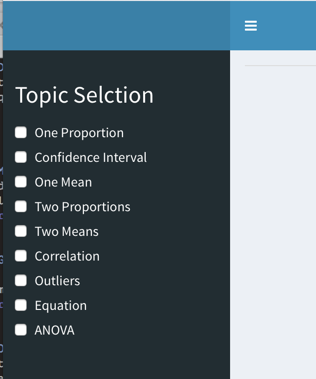
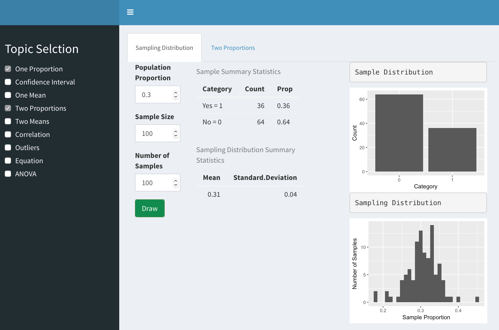
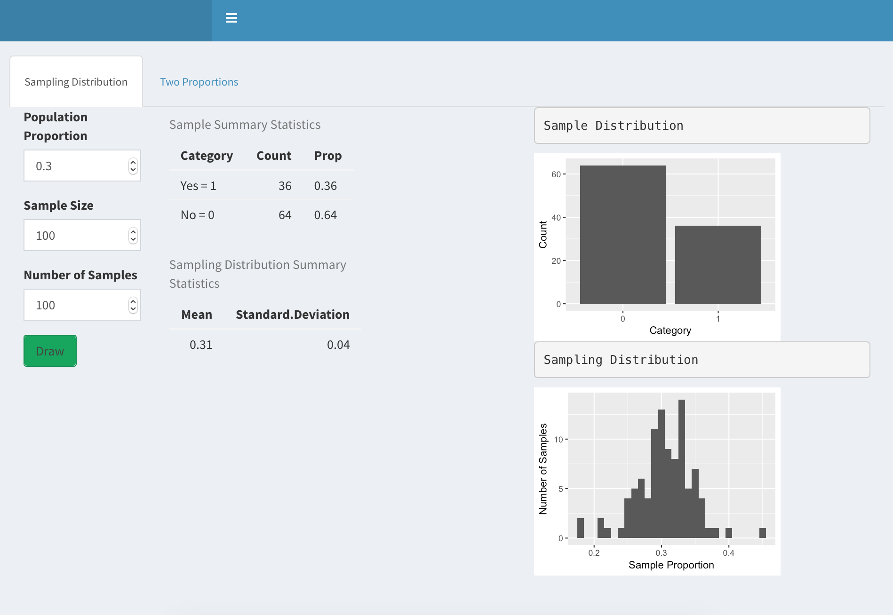

# Background
  As a part of a Creative Component Project I created a Shiny app with tabs for different introductory statistics concepts. There are various tabs pertaining to the topics: linear regression, ANOVA, confidence intervals for one proportion, and sampling distributions for one mean and one proportion, and differences in means and proportions. These are all common topics for study in introductory statistic courses. When the Shiny app compiles all the topics are displayed for selection. However, some instructors and courses will not cover all of these topics and might want to use the Shiny app tab sections individually. Thus, the purpose of this project was to restructure the Shiny App so that it will collect and display only tabs the user desires.


# Ideas 
  Based on the feedback I recieved during my defense of this project, I decided to restructure the app to be able to allow the user to select the tabs they wish to use. One of the main helpful features of the Shiny App framework from R Studio is their ease of use once the app is up and running. However, getting the app up and running in the first place may be difficult for some users. Assuming that instructors of introductory courses in statistics are the main target of this app, we consider that not all of these users may have R programming experience. 

  For those that have R programming, and even Shiny App experience, the server and ui files will be availible to the public on my gitHub page. The users with experience writing Shiny apps could easily run the app and even choose the topics they want and build their own Shiny app with and incorporate those elements. 

  However, I am that not all potential users are familiar with the Shiny App framework, since it is a relatively new tool.  It is important to also acknowledge that the users may not have any programming experince, and thus won't be able to launch the app using the files provided on gitHub.  It is not uncommon that some introductory statistics concepts get taught in high school math courses and AP stat courses in high school, which means the instructors may not have a computing background.  As a result of this, the effort was made to make the Shiny app flexible for non-programmers as well.  In order to do this, another feature of the Shiny App was added where the user is able to select which tabs it desires from inside the Shiny App, and the tabs appear. This means the user does not need to alter any code and thus, does not need to have programming experience. 
  
  Considering some users will only access the Shiny App once it is deployed on the web through the server, the only way to manipulate the code at that time is to put the selection of the tabs into the original Shiny App. Thus, what I decided to do was add a dashbooard that allows the user to checkbox select the tabs they wish to have displayed. Then, the app builds itslef off this input. There were many unforseen difficulties to starting this project. These will be briefly detailed in the following section.


# Difficulties
  The idea of having a Shiny App that updates the layout based on user input did not seem too challenging at first, seeing as the bulk of the programming for the app itself was already completed. However, once I sat down to figure out how to make the program work as I wanted it to, I realized it would be more difficult than I initially had thought. After researching different ways to make the UI layout of the Shiny app, I knew there would be several different roads that I could take to make this work. I tried several different ways and kept hitting dead ends.  I could get none of the specific ways I found to work for my project as it was. Some of the ways included conditional panels, or use if statements in the UI portion of the app, but to code it either of these ways for all the different topics, would make incredibly clunky coding. 

  Eventually, I ended up finding a way to use the renderUI() function to select the tabs desired form a list of the tabPanels. The process of this coming together took longer than I care to admit, but I'm happy with the way the code for this is for now. I avoided using too many for loops and if statements for compiling the Shiny App, which was my main goal for this part of the project. 


# Final result 

The final result makes use of the dashboard feature of Shiny Apps. As seen below, the dashboard on the side of the app has all of the options for tabs to put into the Shiny the main panel of the Shiny App.
```{r, out.width = "200px",out.height = "200px", echo = FALSE}

```

The user can check and uncheck as many boxes they like and the tabs will appear and disappear as they click. As shown below the the boxes for Sampling Distribution for one proportion and Two Proportions are selected and the corresponding tabs are displayed in the main panel.

```{r, out.width = "400px",out.height = "300px", echo = FALSE}

```

In addition, once the choices for tabs are selected the dashboard can be hidden to make more room for the layout. By clicking the three lines at the top the dashboad will hid in the corning until the three lines are hit again, and then it will reappear.

```{r, out.width = "400px",out.height = "300px", echo = FALSE}

```


# Future work & Conclusions
Now that this portion of the project is completed, there are a few other features to be added.  I would like all the graphs to adjust their size and spacing once the dashboard is hidden. This will also look better when the app is launched in the browser. I intend to get feedback on the app and then I can make more adjustments to the format and launching of the different tabs.  There are also adjustments to be made on the content of the tabs, which will be done outside of this project. 


